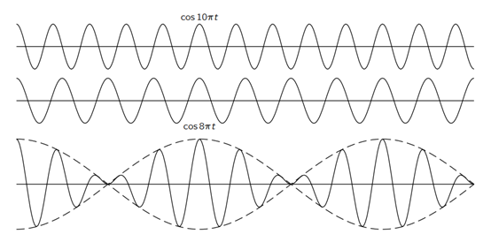
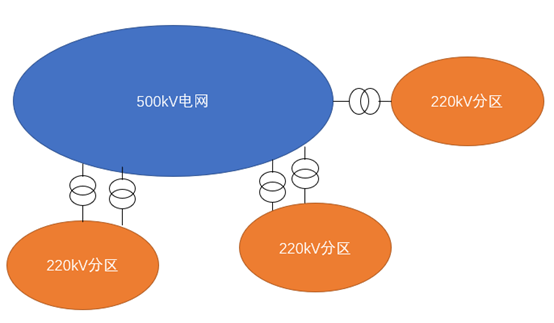
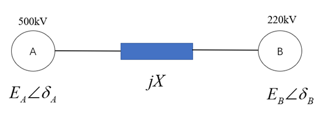

当前新能源高占比的新型电力系统，频率问题变得更加突出。为了深入浅出，本文先介绍了一些物理学和音乐方面的知识，很多不同领域的底层原理是相通的。

在物理学上，频率相近的简谐振动叠加时产生的干涉叫做“拍”。下图是《费曼物理学》中两个简谐波的合成：

具体的推导也很简单，如下所示：
$$
\begin{aligned}
x &= A \cos(\omega_1 t + \varphi) + A \cos(\omega_2 t + \varphi) \\
  &= 2A \cos\left( \frac{\omega_1 - \omega_2}{2} t \right) \cos\left( \frac{\omega_1 + \omega_2}{2} t \right)
\end{aligned}
$$
出现了两个余弦的乘积，其中左侧余弦周期很大，短时间几乎不变化，影响合成后的幅值；右侧余弦可认为是合成的“主导频率”，主导频率是两个频率的平均值。由于振幅的值是周期性的，因此这种特征叫做“拍”。

拍的现象在音乐中应用很深，音乐乐理的基石是十二平均律，每升高一个半音，频率乘以 2^{1/12}，也就是约1.059463倍；从一个给定的音升高12个半音（即一个八度）后的频率将是2倍。

当两个不同频率的声波同时发出时，它们会在空气中相互干扰，形成新的波形。例如，如果有两个音符频率分别为440 Hz和446 Hz，它们的拍频将是6次/秒（446 Hz - 440 Hz = 6 Hz）。如果这两个频率符合简单整数比，这种干扰会产生令人愉悦的和谐音，而复杂的频率比则可能导致不和谐感。

在音乐实践中，使用简单整数比的频率可以创造出和谐的和声效果，这是早期音乐理论和现代音乐理论中非常重要的一个概念。然而，值得注意的是，在实际音乐制作中使用十二平均律系统时，为了能够适应各种调式的转换，真实的频率比已经被略微调整，使得严格的简单整数比并非总是存在。尽管如此，简单整数比依然是和声学和音乐理论中的一个核心概念。从理论上分析，例如，A4（440 Hz）和A5（880 Hz），A5的谐波包括880 Hz、1760 Hz、2640 Hz等，而A4的谐波包括440 Hz、880 Hz、1320 Hz等。两者的谐波在880 Hz、1760 Hz等频率上重合，增强了和谐感。

在调音方面，当调音师调整乐器音高时，通过听拍频的大小来判断两个音是否一致。如果两个音之间的拍频为零或非常小，表示这两个音的频率非常接近或一致。

上面说的是音乐，下面回到电力系统。电力系统的大部分母线是没有直接连接发电机的。那么，在这些母线测量出的频率与发电机转速的关系是怎样的呢？从最简化的角度出发，我们可以将发电机等效为电流源，将负荷等效为阻抗，然后将电流源叠加起来，这样就会形成拍的概念（仅限定于动态过程）。许多人认为电力系统各处的频率是相同的，但这是从稳态角度来说的。实际上，在动态过程中，各处的频率并不相同。拍的合成主导频率不再是发电机频率的平均值，而是加权平均值。电气距离近的发电机对母线频率的影响权重更大。

进一步讨论一次调频。从稳态的角度看，拍是无法形成的。虽然频率测量总有误差，例如实际频率是50Hz，一台发电机的频率测量总是50.0001Hz，另一台发电机的频率总是49.9999Hz，这种频差并不会导致拍。因为一次调频总有死区，频率测量误差一定小于死区，因此处于无控制状态。在这种状态下，发电机的阻尼起到主导作用，阻尼在小的转差下与转差成正比。因此，阻尼可以保证把同步发电机拉到同步，即实际稳态频差为0。

此外，一次调频一定是无差调节，假设一次调频包含了固有的积分环节，控制会不断加码，一个发电机会逐渐减少出力（50.0001Hz），另一个会逐渐增加出力（49.9999Hz），从而无法稳定地分配出力。既然是无差调节，那就无法仅通过一次调频将转速精准调整到预设值。

新能源参与电力系统一次调频是目前的行业热点，我的一位好友最近遇到了困惑的问题。该项目是在某个省级电网，发电是以火电为主，主要集中在500kV电网；同时有大量的分布式电源，主要是接入220kV及其以下电压等级。独立储能运营商的储能电站，有的是接入500kV；有的是接入220kV。这些参与一次调频的储能电站，参数完全一致（包括死区、调差率、动态性能等），发现在相同的时间段，接入500kV的一次调频动作次数明显小于接入220kV的。这让很多人大惑不解，毕竟很多工程师的“思想钢印”是电力系统的各处频率都相等，因为这是交流电网同步运行最基本的特征。但其实，频率本质上是一个动态的变量，与时间、地点都有关系。其实，就算是AGC系统考虑的是准稳态过程，其进入ACE计算的频率是若干个频率遥测的平均值，然后进行简单滤波。

首先是绘制简单的示意图，做方式的朋友很清楚，对于省级电网来说，为了避免电磁环网，220kV电网是分区运行的，如下图所示：

再抽取500kV电网（A）和某个220kV电网（B），把两个电网等效为A、B两个同步机，如下图所示：

我们可以列写转子运动方程：
$$
T_{Ji} \frac{d\Delta\omega_i}{dt} = \Delta P_{mi} - \Delta P_{Gi} - D_i \Delta \omega_i 
$$

转子运动方程中的惯性时间常数，一般是表述成基于机组额定功率；在系统分析中需要换算为基于系统的功率基准值。换算关系如下(以A电网为例)：
$$ 
T_{JA} = \frac{n S_N T_N}{S} 
$$
式中：S为系统的功率基准值，n为A电网的发电机个数，SN是平均机组额定功率；TN是平均惯性时间常数。
显然，我们可以得到：
$$ 
T_{JA} >> T_{JB} 
$$
电网日常小的扰动主要是负荷、新能源的波动，这些扰动显然大概率发生在电网B，我们下面的分析假定扰动发生于电网B。
假设电网B中某个母线发生功率扰动，则t=0时刻，各个同步电机的频率变化率如下：

$$ 
\frac{d\Delta\omega_i}{dt} = \frac{L_{ij}}{T_{Ji}} \Delta P 
$$
式中：Lij是同步功率分配系数（可以由潮流方程换算出来），与电气距离有关。电气距离近的，其数值更大。另外考虑分母数值（惯性时间常数），也得到同样的结论。因此，扰动发生的时刻，电网B的频率变化率大于电网A。
如果更严格的分析，不仅需要考察扰动发生的瞬间，还需要分析扰动发生之后的动态过程。这里就不具体推导，而是直接引用《电力系统稳定分析》（闵勇等编著）第193页的公式，如下（这本书的模型跟我的不完全一致，但都是两机模型，可以说明问题）：

$$  
\Delta \omega_A = \Delta \omega \left(1 - e^{-\sigma t}\right) + \frac{K}{T_{JA}} \Delta \dot{\omega}^*(t) 
$$

$$ 
\Delta \omega_B = \Delta \omega \left(1 - e^{-\sigma t}\right) + \frac{K}{T_{JB}} \Delta \dot{\omega}^*(t) 
$$
可以看出，A和B最终的频率是相同的，但在动态过程中，B的频率变化程度要更剧烈。可以把电力系统动态频率理解为一个池塘，把石块砸入池塘中间，则波纹从中间向四周扩散，最后趋于平静，达到了新的平衡点。在这个短时间的过程中，中间被石头砸的位置变化幅度最剧烈。这就好比电力系统扰动最近的机组，频率变化最剧烈。

因此，本文的模型可以很好的解释新能源电站参与电力系统一次调频的某些疑难现象。实际上，扰动是随时随地的，有正有负，且考虑一次调频和负荷频率特性，500kV的频率变化还会更小。 

电力系统频率稳定问题比我们想象的要复杂得多。为了抛砖引玉，我提几个疑问：

1. 频率变化的时候，影响面很大，测控装置需要重采样，电表在计算功率的时候也要调整。当然，频率测量本身，也是有研究的（可以用锁相环，也可以用更复杂的技术）。这方面有没有归纳总结？

2. 同步电机的基础是派克变换，但派克变换是假定在同步坐标下进行的，频率偏差较大的时候，有些假设是否会出现问题？

3. 频率偏差较大时候，电感换算出的电抗会偏移，电容也类似。是否会对基于潮流和机电暂态的某些结论产生影响？

4. 构网型变流器的发展，可以构造虚拟的角度和频率，这些虚拟量能否与真实的发电机划等号？例如都纳入EEAC的框架中？

通过以上讨论，希望对新型电力系统的频率稳定问题有所启发。
