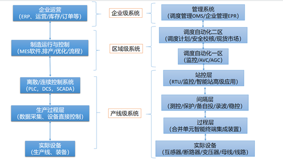

# 工业系统演化与设计

可以回顾公众号的第1篇文章，这篇文章体现了我建立公众号的初衷：“电力系统是工程技术领域最复杂的系统之一，我开通这个公众号，是希望从系统性、同时也不失底层细节的情况下来更深入地认识电力系统。”但究竟系统究竟指的是什么，有哪些特点，这篇文章只是一笔带过。本文展开来谈谈工业系统的特点。

关于系统科学和系统工程，钱学森同志有巨大的贡献。他首先提出将科学、工程技术、管理结合起来，进行综合集成。系统的一个最重要的特点，就是系统在整体上具有其组成部分所没有的性质，这就是系统的整体性。系统的整体性是涌现出来的，不是简单还原加拼接就有的。系统结构是我们能够改变、调整、设计和组织的。这样，我们便可以通过改变、调整系统组成部分或组成部分之间、层次结构之间以及与系统环境之间的关联关系，使它们相互协调与协同，从而在系统整体上涌现出我们满意的和最好的功能，这就是系统组织管理、系统控制和系统干预的基本内涵，是系统管理、系统控制等要研究的基本问题，也是系统工程、控制工程等所要实现的主要目标。
下面，我再结合工业系统（尤其是电力系统），谈谈我个人的认识。
首先，工业系统的一个典型特点是分层结构，下面的图是我画的。左边表示的制造业系统分层结构（参考ISA-95标准）；右边是电力系统分层结构（参考IEC61850和IEC61970标准）。由此可见，工业系统的分层特性具有相似性和普遍性。

 
这一点与互联网的to C系统具有本质不同。当然，互联网系统当然也是分层的，尤其是后台数据系统，但分层特性没有工业系统那么明显。例如，to C系统的个人用户数据，基本都是汇总到数据中心去处理。因此，互联网的技术专家特别强调解决高并发的问题，但单一业务并不复杂（这也是很多程序员吐槽自己做的事“增删改查”的工作）。工业系统的特点是：低层系统绝大多数采集的数据都是就地处理和用于控制；上层起到协调、优化的作用，越上层的工业系统协调的范围越大，但离实时控制越远。这就导致高并发不是工业系统的首要矛盾，工业系统的主要挑战在于：业务的高度复杂和定制、优化有很大的困难和空间，以及业务与物理过程不可分（意味着系统无法脱离工艺和实际设备而存在，如果有的“工业系统”只是给领导看大屏，那就跟放电影没区别）。

这就可以从本质上解释，互联网的经验和技术，不可能直接移植到工业系统。当然，信息技术和互联网的发展，确实给工业系统的演化带来新的机遇，这一点主要是工业系统演化中，可用的“工具”变多了，甚至有巨大的变化。以前做不了的事情，通过数字化的发展，变得可以去做了。有一点必须注意：信息技术的发展，导致工业系统可以采用新的工具改进管理和生产，但这种改进并不是把互联网的东西直接搬过来的，而是间接形成的。

其次，从最简单的划分来说，工业系统由硬件、软件、管理组成。管理是通过硬件和软件间接发挥作用。现代工业系统的演化趋势是，软件越来越起到重要作用。现在，哪怕是嵌入式工程师、硬件工程师，甚至是芯片工程师，他的主要工作，其实还是在与软件打交道。软件在工作中的占比，似乎可以判定企业的数字化水平的高低。比如说，在几十年前，保护是用继电器硬件实现的，其图纸复杂到一张桌子摆不下，现在保护已经完全由软件实现。还有，输电线路的巡检，以前似乎是纯粹的硬件相关工作，而且是很辛苦的重体力劳动。但现在各种传感器、无人机、线路监测系统的发展，线路巡检已经有越来越多的软件参与了。

软件的发展和低边际成本特性，可以使得系统拆分成不易变部分和易变部分。易变部分尽量由软件执行，将大大降低系统演化成本、提高系统技术更新换代速度。这就是“软件定义”。基于易变部分的基础上，管理的“敏捷方法”也可应用起来了。要注意，敏捷方法应用于成本高的不易变部分，只能适得其反。管理不存在万能的方案，技术也一样。
工业系统的“软件定义”，我们轻易可以举出好几个例子：

1. 软件定义通信(SDN)，在这个架构中，网络的控制平面（决定数据如何流动）被抽象出来，通过集中化的软件应用进行控制，而不是分布在各个网络设备上。这使得网络管理员可以更容易地设计和管理网络，实现网络流量的优化、自动化配置、故障快速修复等。

2. 基于PLC的自动化控制系统：在很多工业自动化系统中，设备的控制逻辑是通过PLC（可编程逻辑控制器）上的软件来定义的。比如，工厂的生产线上的机器的启停、运行速度、配料比例等都可以通过修改PLC程序来改变。

3. 备自投远程自动投退系统(ABC)，这是东方电子公司在广州电网实现的系统，备自投装置在变电站工作，但是软件可以通过全局信息，判断备自投动作后是否引起主变过载，从而实现远程投退。这样人工繁琐的备自投投退工作变为软件自动实现。

有的工业系统，似乎从头到尾都是不易变的，例如建筑、土木工程、工厂建设。正如西门子总裁前段时间说的“西门子在南京建设了一个工厂，但是在建设之前，已经在数字系统中建设了一遍，现实中的工厂建设是第二次”。也就是说，复杂系统建设前已经先在软件中演化了一遍。我们发现，很多系统演化的工作都似乎是“补救”，比如说，生产线已经建设好了，但是不稳定有抖动，然后请控制工程师补救，采用模型预测控制等高阶算法改善运行情况，把新的控制算法“外挂”到DCS系统。又或者电网运行过程中负载过高超过了规划设想，这时候要通过各种需求侧的技术来避免直接拉闸限电。软件数字化的发展，可以使得问题解决时机“前移”。问题解决得越早、代价和成本越小。系统在总体设计中，就可以进行系统运行仿真模拟（虽然这种仿真跟现实必然存在差距）。在系统规划设计阶段，就要把控制运行等诸多问题考虑进来；在系统运行阶段，也要把未来的规划问题提前考虑并且自动生成初步方案。

具体到电力系统，我们可以预期电网规划的数字化很快将提上日程，而不是现在这样的离线作业，与现实中的生产控制系统脱节。其实，范明天教授很早就提出过“电网规划运行一体化”，但一体化工作需要建立在实用性的数字平台基础上。
最后，再谈一谈系统与管理，这两者是相辅相成的。工业系统的必备环节是反馈和控制，必须能够适应不断变化的环境和需求。对应到管理上，则是PDCA循环，含义是将管理分为四个阶段，即Plan（计划）、Do（执行）、Check（检查）和Act（处理）。良好的管理可以为系统演化提供一个有利的环境，例如，通过科学的规划和合理的资源分配，可以提高系统的可靠性和经济性。另一方面，数字化系统和技术本身也可能带来新的管理工具和方法，从而改善管理效果。
