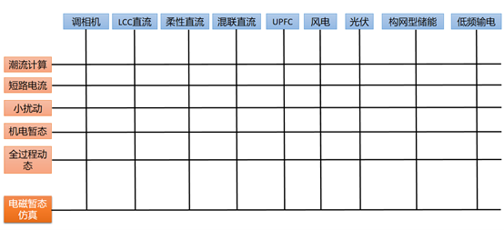
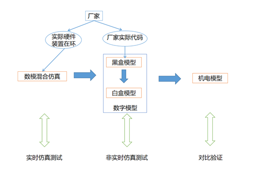

# 电力系统仿真会议参会记录

本文主要记录最近两年参加的仿真技术研讨会。

## 2023年会议
2023年9月我参加了在贵州举办，由中国电科院系统所举办的“2023年度电力系统仿真分析新技术研讨会”，收获颇多。这是我自2019年以来第一次参加学术会议（上次是在山东青岛参加的研讨会），竟然有4年之久没有出门参会了。真的感觉同行单位的进展日新月异，非常佩服。在会上一度用脑过度，接受信息实在太多了，学到了很多新知识。本文为参会总结，另外夹杂一些自己的思考。
这次研讨会大约举行了42场报告，我大概认真听了其中28场报告，另外的报告PPT也学习了。中国电科院系统所/仿真中心报告了最近4年来，他们在电力系统仿真分析方面的最新进展，大约可以分为以下三个方面：
1）电力系统呈现高比例可再生能源、高比例电力电子设备的“双高”特征，大量的新设备投运，仿真软件需要为这些新设备建模。这些新设备除了调相机之外，其余基本上是电力电子技术的推动而发展的。当然，调相机也是为了增加交流系统强度。具体可以看下面的示意图，是不是相当有冲击力？（该图与电科院产品不是严格对应的，例如全过程动态还有AGC、锅炉、稳控装置的模型；电磁暂态仿真目前可能还没有低频输电的模型）。
 

任何一种设备在电力系统运行，从物理上来说，都是单一的实体，并没有分成潮流部分、机电暂态部分、电磁暂态部分。我们不同的模型只是分析侧重点不同。我认为以前的研发工作，对于横向切的过细，对于纵向的整体性强调的不够，以至于造成支离破碎的感觉。对于横向切分而言，我认为其实只需要分成两个细分方向就可以：基于相量模型的分析算法（潮流/机电/小扰动/短路）；基于瞬时值模型的分析算法（电磁暂态）。
2）为仿真软件提供实用性工具。具体包含以下方面：自动辅助调试潮流断面的工具；自动寻找方式，满足断路器开断电流要求；还有可视化的一些效果；以及模型维护工作的多人协作等。在电磁暂态仿真方面，直接将调试工作降到最低，可以直接从机电暂态模型自动生成电磁暂态模型，并且可根据潮流断面完成初始化，从而节省大量的调试时间。
3）开发新的平台，特别是与调度自动化系统在线联动。例如负荷建模系统，可以从调度自动化系统，甚至用电采集和PMS系统中获取信息，最终合并整合成可以动态变化的负荷模型。周二专汇报了基于数字孪生技术的新型在线分析系统，这是建立在调度自动化系统基础上的，可以快速更新状态、调度规则的电子化建模，并实现未来电网运行推演。
关于负荷的动态建模，在线化的方向我是完全赞成的。但是把建模的电压等级无限降低是不现实的。每下降1个电压等级，模型规模可能至少增加100倍。我们往配网建模，无非是很多负荷具有主动性，而这些主动性是聚合之后再与大电网互动的。实际的电网调度控制系统不可能与单个的负荷打交道，总要有边缘或者中间聚合环节。因此，对于虚拟电厂、负荷聚合商等的建模，其实把整体聚合互动的特性纳入模型就可以了。也就是说，负荷的精细化建模是信息物理混合的，其中主动性主要由信息模型体现。完全没有必要每个负荷都建模。
这次研讨会，刘文焯专家带队的PSModel团队在电磁暂态仿真方面给人留下了深刻的印象，我认为他们最大的贡献是把PSD-BPA模型直接转换为电磁暂态模型，从而节约大量的调试时间。此外，在直流模型和新能源构网型电磁暂态模型方面，也做了很深刻的研究。例如他们报告了某送端电网的电磁暂态仿真，采取了构网型新能源，确实很难脱机了。但是在故障时加大了加速功率，反而容易引起功角的失稳。（我在这里引申一下，如果改成直流连接的异步电网，此送端电网增加构网型新能源则容易引起频率失稳）。看来，未来方式分析和稳定控制装置，已经不可能忽视构网型新能源的影响了。PSModel团队的汇报讨论环节也非常热烈，观众都非常感兴趣。我也问了几个问题，其中一个问题是：“构网型电力电子装置模拟出电压相量，从而有了角度，这时候构网型新能源能不能纳入到EEAC的分析框架，从而实现暂态稳定的定量分析？”。这个问题或许是可以研究的。
为了保证模型的正确性，电科院团队提出了完善的建模流程。下面的图是我重绘的简化版示意图。可以看出，电磁暂态仿真已经是仿真体系的核心位置，模型的正确性很大程度上由电磁暂态仿真（包括实时电磁暂态仿真）来保证。

 
在10多年前机电暂态的时代，关于为什么电科院保持PSASP和PSD两个功能差不多的软件并行开发?有种说法是为了保证模型的正确性，因此需要两个软件相互校对。这种说法在今天的条件下，似乎已经不成立了。我觉得可以建议未来若干年时间，逐渐把PSASP和PSD合并成一个软件（模型也可以不统一，现在的模型转换工具已经成熟了，但算法需要统一），这样可以提高开发团队的工作效率。其实目前已经在过渡了，很多新能源、直流模型是两个软件所共用。另外，传统模型如同步电机其实已经也统一了。例如PSASP的-1到-6同步电机模型其实就是BPA的同步电机模型，这两种同步电机模型的差异主要是派克原始方程电感参数的近似处理不同。
在与中国电科院系统所研发人员的交流中还得知，现在很多核心代码还保留Fortran代码，包括f77、f90。我刚工作的时候其实也维护过Fortran代码，但是至少8年前我在的团队已经全部把Fortran代码重构为C++代码了。据我的了解，有的单位重构时间还要更早一些。我认为部分代码重构工作是有必要性的，尤其是对Fortran代码的处理，保留Fortran意味着现代软件工程很多先进思想无法应用。

## 2024年会议

2024年，我参加了在郑州召开的“第11届电力系统电磁暂态仿真技术会议”，主办方是中国电科院系统所/仿真中心。会议发布了ADPSS 3.0版本，并进行了现场展示。同时介绍了电力系统电磁暂态仿真的相关技术进展和应用情况。

在技术方面，我作为听众收获很大，学到了许多新知识。本篇文章不是谈论技术的，我想谈谈技术之外的一些观点，不是很严肃的讨论，仅供参考。

首先，搞科研需要前瞻性，这种前瞻性不是虚无飘渺、自说自话的“前瞻性”，而是立足于对未来趋势的精准预测基础上。专家水平的判定标准，很大的因素是对未来的趋势预测准确度，而不是事后的分析解释（事后的分析并不是不重要）。ADPSS是2009年获得国家科技进步一等奖的，立项时间要早得多。在21世纪初期，新能源和电力电子并没有像现在这样大范围铺开，只是刚有些试点而已。一直到几年前，我都还听到某些很有地位的专家在质疑大电网电磁暂态仿真的必要性，现在应该是完全没有质疑声了。同时，在21世纪初期，研发实时装置所需要的软硬件支撑条件，也远没有现在这样轻松。所以说，ADPSS的立项，是需要勇气的，也不得不佩服以周孝信院士为代表的中国电科院专家团队。

可以说，在相当长的时间内，国产系统级的大电网实时仿真，只有中国电科院一家在做。当然，我这里并没有否认上海远宽等公司的成果，但这些公司更偏向于设备测试。再考虑到中国电科院的业务主要是：技术支撑、科技项目、检测服务等，并没有南瑞那样的装置研发业务和经验，那就更不容易了。

我三年前在公众号发布了1篇文章《谈谈电力系统仿真》（有兴趣的同行可以阅读），里面提到“仿真本身的商业模式可能会发展。目前，仿真更多的处于幕后，为科技项目、设备检测、规划设计等提供支撑，仿真本身并不处于前台。那么，以后随着仿真需求的多样化、细分化，及国产化的推进。我预测仿真本身可以（包括仿真装置的提供和建模技术服务等）可以独立成一个市场，虽然这个市场空间没有现在的调度或者配电那么大”。三年后再来看，在商业模式方面，确实这个市场已经具有雏形了。新能源公司（也包括南瑞、许继等传统电力系统厂家）与中国电科院、省级电科院已经形成了一个仿真细分市场。有的新能源公司自己研发实时仿真装置，供自己使用；有的新能源公司对外采购仿真建模服务；多个新能源公司招聘建模仿真方面的高端人才；很多新能源公司的研发人员就常驻在电科院系统所的办公室，随时沟通解决建模方面的问题。这个仿真市场的规模可能比不上调度、配网，但重要性完全不能用合同金额来衡量。因为仿真起到支撑作用，对于电力系统规划、装置研发质量把控等，都有重要的作用。可以期待，仿真这个细分市场，将会继续发展。

我在这次会议上，感受到了电网规划对于仿真的需求显著增加了。以前的电网发展规划，相对于调度、设备这块，数字化应用水平是相对落后的，本来问题不太大，但是现在遇到了新的问题。原先规划分析中应该没有问题的设备，在“双高”的实际运行中却出现了大问题。无论是电力系统，还是互联网软件开发等任何行业，问题暴露得越早，解决问题的成本越低。规划中没有解决的问题，扔给调度运行，那就相当被动了，设备改造和稳控装置的“打补丁”，代价是巨大的。这就不得不把仿真前移，在规划阶段就要考虑电磁暂态仿真建模。中国电科院在规划方面，侧重于推出PSModel软件。在本次会议上，PSModel软件和ADPSS多次相提并论，这在以前是没有看到的。PSModel侧重离线分析，目前还没有实时、硬件在环等功能。我很期待以后的仿真会议上，能够看到电网规划部门开展电磁暂态仿真的成功案例。我甚至想，可能未来规划阶段就要开展实时仿真和硬件在环仿真，以便进行原型电力系统的验证了。

未来电力系统的趋势是开放性，电网只是电力系统的一部分，这也要求我们的仿真系统提高开放性。这在本次会议上，也看到了ADPSS开发了新的大量的接口，以及面向新能源厂家的黑盒/白盒模型。在未来，ADPSS可能会通过云服务的方式扩大用户规模，甚至可能向系统外的企业、高校开展仿真服务。在开放性方面，商业公司提供接口是一种方式；另外一种方式是发展开源软件，前段时间中国电科院发布了开源的仿真算例，这是很好的。其实我也思考过，电力系统的市场规模那么大，技术人员那么多，为什么没有像互联网行业那样形成开源的氛围，这点以后可能会写成文章讨论。

在任何一个市场，竞争是技术进步的推动力，垄断则可能导致固步自封。我想，哪怕是电科院的销售和研发人员，也不能说“ADPSS已经尽善尽美了”。竞争来自于两方面，首先是RTDS、RT-LAB等国外产品，仍然有许多值得称道和学习的地方。另外，国内越来越多的单位，也开始自研相关的仿真软件和实时装置，新的产品会更关注独特的细分需求。

最后谈一谈仿真建模方面的人才培养。仿真建模这个领域，使用别人开发好的软件，搭建模型算例，进行机理分析和仿真研究，然后发表高水平论文，是不是就够了？以我个人的经验，是远远不够的。仿真是软件定义的，是算法密集的领域。用一个不太恰当的比喻，虽然大多数驾驶员不需要了解汽车制造业，但赛车手对汽车制造的很多细节都是清楚的。有些东西，不亲自试验（哪怕是编写简单的原型软件），未必能理解深刻，甚至都未必能意识到。当然，这只是个抛砖引玉的观点。
