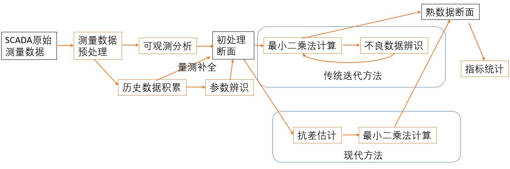

# 谈谈电力系统状态估计

本文主要是对电力系统状态估计的一些思考，但不涉及具体的状态估计算法。对于具体的状态估计算法，后面有时间会专门写文章论述。

说起状态估计，我差不多10年前，一直出差全国各地。在现场做的最多的一件事，就是帮助调度中心用户调试状态估计（也包括潮流断面）。因此在状态估计方面，积累了工程经验，有一些心得体会。

关于电力系统状态估计的定义，在电力系统调度自动化的书籍都会介绍，这里不再重复。让我们稍微思考深一点，从认识论的角度来思考：定量分析必须建立在测量数据的基础上，没有测量数据，那一切规律验证、实时控制都变得不可能；定性的规律也需要经受数据验证；建模仿真似乎可以 “离线”，但是设备模型和参数归根结底还是来自于试验数据。因此，每一个学科领域，都存在测量和测量数据的处理。下面的表格仅仅列举部分学科：

| 学科领域 |        名词         |                       简介                       |
| :------: | :-----------------: | :----------------------------------------------: |
|  经济学  | 经济统计/计量经济学 |           利用经济数据进行模型回归计算           |
|   测绘   |  工程测量/测量平差  | 测量平差就是用最小二乘法原理处理调整各种观测结果 |
|  互联网  |  数据采集/数据清洗  |    数据清洗是数据分析项目中提高数据质量的方法    |

从这个意义来说，电力系统的测量、及其测量数据处理，是非常重要的内容。要注意，我并没有说电力系统的测量数据处理就等于状态估计，只不过状态估计是电力系统测量数据处理中最重要、最有代表性的算法。

电力系统分析教材有“三大计算”的说法，分别为：潮流计算、短路计算、稳定性计算。我认为，电力系统测量数据处理（状态估计）的重要性应该可以作为“第四计算”。之所以基础教科书不讲解状态估计，是因为教科书编写的时候，电力系统的自动化和数字化发展水平尚未达到很成熟的水平，大量的电力系统计算工作是离线完成的，甚至是采用纸和笔手工完成的。好在，我看到最新出版的一些书，比如印度D P Kothari I J Nagrath 著《现代电力系统分析（第四版）》已经把状态估计作为独立的一章讲授了。

电力系统状态估计的核心算法是最小二乘，事实上隐含了测量数据服从最小二乘的分布。这种假设合理吗？其实并不合理。但仍然有积极意义，至少是工程近似的。对于调度中心来说，数据来源多样，数据传输的过程中经过了大量的环节。按照中心极限定理，大量独立随机变量近似服从正态分布。在生产中，一些现象受到许多相互独立的随机因素的影响，如果每个因素所产生的影响都很微小时，总的影响可以看作是服从正态分布的。在电力系统生产来说，同时保持大量设备的独立运行（某个变电站的某个测控装置损坏，不至于影响全电网的可观测性）。随机因素的独立性是有一定工程近似意义的。(当然这种近似是仍然是非常有限的，我统计过调度中心数据，与真正的正态分布还是有差距)。

继电保护装置的测量数据处理跟调度中心是非常不一样的。继电保护设备部署在变电站的间隔层，与过程层和一次设备联系紧密、耦合性强，同时调试也严格的多。因此继电保护的测量数据不符合独立分布的假设，保护的数据处理主要包括：采样、滤波、傅里叶算法，很少考虑正态分布和随机误差。保护总会设置冗余度（就是保证定值有一定的灵敏度），随机误差不会有严重的影响。但是继电保护考虑系统误差更多一些，例如距离保护中识别系统振荡；互感器的饱和；变压器的励磁涌流，等等。

下面是我画的状态估计流程，可以看出，实际现场的状态估计不是单一算法，而是一系列算法的集合。因此，开发实用化的状态估计应用是非常有难度的。其难度和状态估计的理论研究相比，几乎可以用“天壤之别”来形容。

 
下面是状态估计的几个运行模式：

 
下面是国内几家状态估计程序的情况（我了解到的，肯定是不全的）

|         产品         |        单位         |                             描述                             |
| :------------------: | :-----------------: | :----------------------------------------------------------: |
|    D5000状态估计     | 南瑞科技/电网分公司 | 覆盖中国几乎全部调度控制中心，为调度基础数据质量提供支撑工具 |
|    D5000状态估计     |  中国电科院/电自所  |                        国调使用该程序                        |
| 东方电子状态估计程序 |      东方电子       |   应用于部分调度中心，是首个运行于国网调控云的状态估计程序   |
| 清大高科状态估计程序 |   清华大学电机系    |         应用于部分调度中心，对抗差估计的学术研究较深         |
| 浙江大学状态估计程序 |      浙江大学       |                       应用于部分配电网                       |

和潮流计算相比，状态估计程序更复杂，更贴近工程实践，几乎没有开源代码。关于状态估计的理论研究，我以前写过一个答案，现在摘抄到这里，或许有参考意义：

状态估计论文方面，应多选择有实际工程经验的单位发的论文，首先推荐南瑞的，还有清华张伯明组的。无论以什么样的角度来说，状态估计都是强烈工程应用导向的，从来都不是一个纯学术问题。例如，为什么AGC、AVC控制不直接使用状态估计数据，还是以SCADA数据作为主要依据。这些问题在开始研究前需要先想明白。
